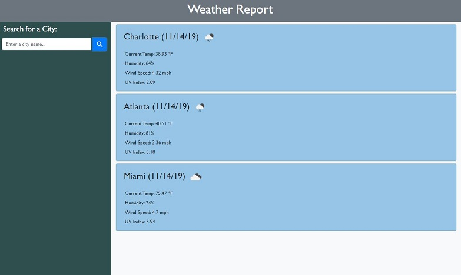

# [Weather-Report](https://lbernadel.github.io/Weather-Report/)

## Description

This goal of this assignment was to utilize OpenWeather APIs to make an application that displays current weather information (in Imperial Units) for the city that a user inputs. The current weather information displayed includes the following at the minimum:
* City's Name
* Today's Date
* Weather Icon (displaying current conditions)
* Temperature
* Humidity
* Wind Speed

The weather data for a city is displayed on the dashboard, below any existing search results.

For further challenge, we could display this information in addition:
* UV Index
* Forecast for the next 5 days:
  * Date
  * Icon
  * Temperature
  * Humidity

Relevant class concepts from the week: Server-Side APIs, AJAX calls, JSON object format

## Challenges

My biggest challenge was to dynamically create the weather information while implementing Bootstrap utilities to achieve the desired layout for each city input. I also got confused by the response calling the weather icon an icon when technically it was an image. Once I realized that, I was able to switch from `<i>` to `` and the URL I created for the weather icon worked fine.

Of the challenge features, I did the UV Index but couldn't figure out how to display the color that corresponds with the UV index level. I tried `if` statements but couldn't figure out how to get the value to stay a number instead of coming back as undefined or [object Object].

### Sources
- [OpenWeather: Current Weather API](https://openweathermap.org/current)
- [Weather Icons](https://openweathermap.org/weather-conditions)
- [OpenWeather: UV Index API](https://openweathermap.org/api/uvi)